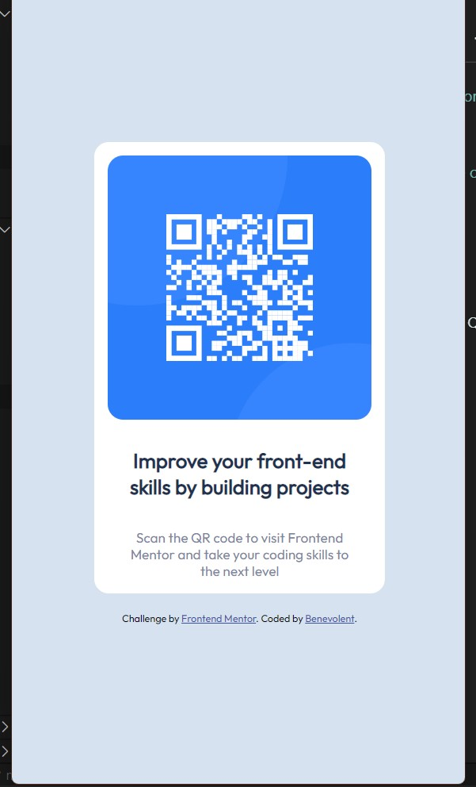

# Frontend Mentor - QR code component solution

This is a solution to the [QR code component challenge on Frontend Mentor](https://www.frontendmentor.io/challenges/qr-code-component-iux_sIO_H). Frontend Mentor challenges help you improve your coding skills by building realistic projects. 

## Table of contents

- [Frontend Mentor - QR code component solution](#frontend-mentor---qr-code-component-solution)
  - [Table of contents](#table-of-contents)
  - [Overview](#overview)
    - [Screenshots](#screenshots)
      - [Desktop](#desktop)
      - [Mobile](#mobile)
    - [Links](#links)
    - [Built with](#built-with)
  - [Author](#author)

## Overview
This is one of the solutions for the QR code component challenge. I would'nt say the this is a hack for the solution. But this is a good hack.

### Screenshots

#### Desktop

---

#### Mobile

---

### Links

- Solution URL: [Github Repository](https://github.com/bene-volent/qr-code-component)
- Live Site URL: [Github Page](https://bene-volent.github.io/qr-code-component)

### Built with

- Semantic HTML5 markup
- CSS custom properties
- Flexbox
- CSS Grid
- Mobile-first workflow

## Author

- Frontend Mentor - [@Benevolent](https://www.frontendmentor.io/profile/bene-volent)
- Twitter - [@Benevolent](https://twitter.com/bene_volent_)
<<<<<<< HEAD
=======
=======
# Frontend Mentor - QR code component solution

This is a solution to the [QR code component challenge on Frontend Mentor](https://www.frontendmentor.io/challenges/qr-code-component-iux_sIO_H). Frontend Mentor challenges help you improve your coding skills by building realistic projects. 

## Table of contents

- [Frontend Mentor - QR code component solution](#frontend-mentor---qr-code-component-solution)
  - [Table of contents](#table-of-contents)
  - [Overview](#overview)
    - [Screenshots](#screenshots)
      - [Desktop](#desktop)
      - [Mobile](#mobile)
    - [Links](#links)
    - [Built with](#built-with)
  - [Author](#author)

## Overview
This is one of the solutions for the QR code component challenge. I would'nt say the this is a hack for the solution. But this is a good hack.

### Screenshots

#### Desktop

---

#### Mobile

---

### Links

- Solution URL: [Github Repository](https://github.com/bene-volent/qr-code-component)
- Live Site URL: [Github Page](https://bene-volent.github.io/qr-code-component)

### Built with

- Semantic HTML5 markup
- CSS custom properties
- Flexbox
- CSS Grid
- Mobile-first workflow

## Author

- Frontend Mentor - [@Benevolent](https://www.frontendmentor.io/profile/bene-volent)
- Twitter - [@Benevolent](https://twitter.com/bene_volent_)
>>>>>>> 5cc3e5b99d43224b2d49791de9929870118c7e16
